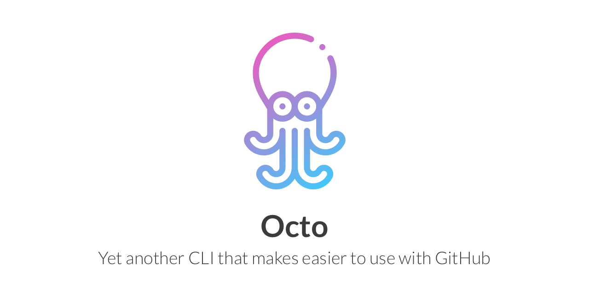

## Background

[github/hub](https://github.com/github/hub) is a cool tool.
But the tool doesn't have some features like allowing squash merge when creating a repository.

Octo is a simple wrapper of GitHub API like hub but gives some features which hub doesn't. 

## Environment variables

- `GITHUB_TOKEN`

## Usage

Currently, **Octo** supports the features:

- Creating a repository

```
$ octo repo create --help
Usage:
  octo repo create [flags]

Aliases:
  create, c

Examples:
octo create <org>/<repo> --license-template apache-2.0 --allow-squash
octo create <repo> --auto-init --gitignore-template go --allow-squash

Flags:
      --allow-merge-commit          Whether allowing merge commit or not
      --allow-rebase-merge          Whether allowing rebase merge or not
      --allow-squash-merge          Whether allowing squash merge or not
      --auto-init                   Whether automatically initializing repository or not
  -d, --description string          The description of repository
      --gitignore-template string   The gitignore template
  -h, --help                        help for create
      --license-template string     The license template of repository
  -p, --private                     Whether the repository is private or not
```

### Reference

#### Merge option

- [About pull request merges - GitHub Help](https://help.github.com/en/github/collaborating-with-issues-and-pull-requests/about-pull-request-merges)

#### .gitignore template

- [github/gitignore](https://github.com/github/gitignore)

#### License template

- [Licensing a repository - GitHub Help](https://help.github.com/en/github/creating-cloning-and-archiving-repositories/licensing-a-repository#searching-github-by-license-type)

## Note

*Icon made by Freepik from [www.flaticon.com](https://www.flaticon.com)*
